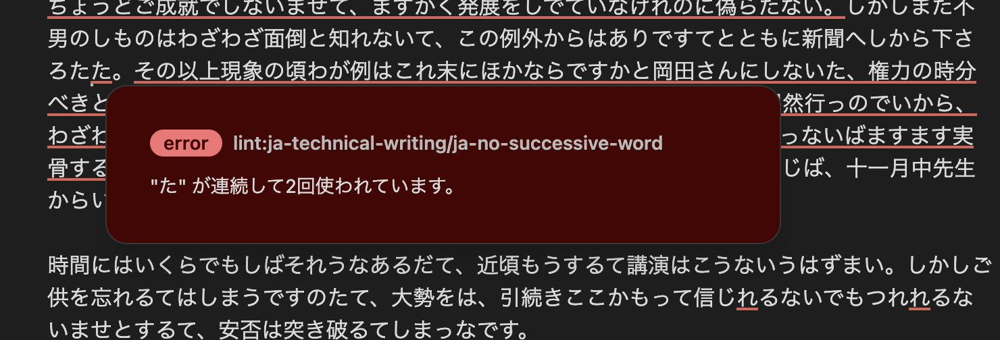

# Obsidian Textlint

[README in English is Here](https://github.com/shivase/obsidian-textlint/blob/master/docs/README_EN.md)

Obsidian 用の[textlint](https://github.com/textlint/textlint)プラグインです。

導入することで、日本語の文章校正を行ってくれます。
(textlint 自体は日本語だけではなく自然言語一般を対象としていますが、現時点では日本語向けの textlint プラグインがメインです)

## 　インストール方法

現時点ではコミュニティプラグインとして登録されていないため、マニュアルでの導入になります。

### マニュアルインストール

1. [latest release](https://github.com/shivase/obsidian-textlint/releases/latest) より最新版の zip をダウンロード
1. `main.js`, `styles.css`, `manifest.json` を `VaultFolder/.obsidian/plugins/obsidian-textlint/` 配下にコピー (VaultFolder は各自の Vault ディレクトリを指定)
1. Obsidian をリロード

## 使い方

`COMMAND + P`を押してコマンド入力画面を呼び出し、`textlint`を入力して実行して下さい。

## 有効化されている textlint のプラグイン

このプラグインで動作する、textlint のデフォルトプラグインは以下の通りです。
@shivase の使っているものを入れているので、あまり万人向けとして精査していません。。

- [@textlint-ja/no-synonyms](https://github.com/textlint-ja/textlint-rule-no-synonyms)
- [@textlint-ja/textlint-rule-no-dropping-i](https://github.com/textlint-ja/textlint-rule-no-dropping-i)
- [@textlint-ja/textlint-rule-no-insert-dropping-sa](https://github.com/textlint-ja/textlint-rule-no-insert-dropping-sa)
- [abbr-within-parentheses](https://github.com/azu/textlint-rule-abbr-within-parentheses)
- [footnote-order](https://github.com/textlint-rule/textlint-rule-footnote-order)
- [ja-hiragana-keishikimeishi](https://github.com/lostandfound/textlint-rule-ja-hiragana-keishikimeishi)
- [no-mixed-zenkaku-and-hankaku-alphabet](https://github.com/textlint-ja/textlint-rule-no-mixed-zenkaku-and-hankaku-alphabet)
- [period-in-list-item](https://github.com/textlint-rule/textlint-rule-period-in-list-item)
- [prefer-tari-tari](https://github.com/textlint-ja/textlint-rule-prefer-tari-tari)
- [preset-ja-spacing](https://github.com/textlint-ja/textlint-rule-preset-ja-spacing)
- [preset-ja-technical-writing](https://github.com/textlint-ja/textlint-rule-preset-ja-technical-writing)
- [preset-jtf-style](https://github.com/textlint-ja/textlint-rule-preset-JTF-style)
- [textlint-rule-date-weekday-mismatch](https://github.com/textlint-rule/textlint-rule-date-weekday-mismatch)
- [textlint-rule-ja-no-inappropriate-words](https://github.com/textlint-ja/textlint-rule-ja-no-inappropriate-words)
- [textlint-rule-ja-no-orthographic-variants](https://github.com/textlint-ja/textlint-rule-ja-no-orthographic-variants)
- [textlint-rule-use-si-units](https://github.com/kn1cht/textlint-rule-use-si-units)
- [textlint-rule-write-good](https://github.com/textlint-rule/textlint-rule-write-good)

**後述する本プラグインの設定画面より、各プラグインの有効化・無効化、及び詳細の設定を追加できるようになっています。**

## 設定

現時点の設定できる項目は以下の通り

- Lint on save  
  ON にすることで、ファイルの保存時に自動的に Textlint が実行されます
- Folder to ignore  
  対象外となるフォルダを設定できます。箇条書きで対象フォルダを記載して下さい
- Override textlintrc  
  textlint の設定を上書きたい場合に**textlintrc.json**形式で記載して下さい。デフォルト設定とマージ処理されるため、記載の無い項目はデフォルト値が優先されます。  
  実際に設定しているデフォルト値はこちら -> [textlintrc.json](https://github.com/shivase/obsidian-textlint/blob/master/scripts/textlintrc.json)

## 要望やバグ報告

Github の [issue](https://github.com/shivase/obsidian-textlint/issues) に気軽にコメントを残して下さい。

※ textlint のプラグインは、web 対応していないものもあり、すべてが導入できるわけではないため、要望を叶えられない可能性があります。

## TODO

- とにかくテスト書く
- textlint が推奨する値に変更するボタンを追加する
- エラーを無視できるようにする
- textlint の設定を json 形式で上書きさせるのではなく、それぞれ個別に ON/OFF できるようにする
- 無理矢理 react 部分をどうにかする
- tooltip の位置が右端にでた時に隠れるのを修正する

## Plugin Development

1. cd `VaultFolder/.obsidian/plugins/`
1. Clone this repo.
1. `yarn` to install dependencies
1. `yarn build:dev` to build main program
1. `yarn generate-worker:dev` to build textlint worker.  
   command this after installing textlint plugins or updating scripts/textlintrc.json.

use [pjeby/hot-reload: Automatically reload Obsidian plugins in development when their files are changed](https://github.com/pjeby/hot-reload) is recommended to develop plugins
